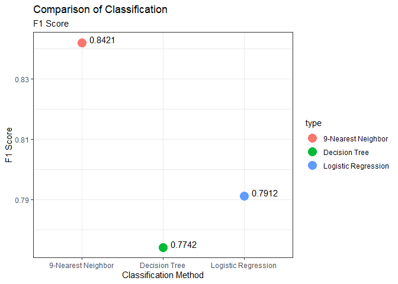

hd\_knn\_tree
================
Dany Park
01/03/2021

# K-nearest neighbor and Decision Tree

This project is to apply K-Nearest Neighbor and Decision Tree to the
heart disease dataset and apply fitted model to predict the potential
patient. Also, the models are compared with the Logistic Regression for
their accuracy and predictability.

The
[hd\_log\_reg](https://github.com/danypark91/hd_log_reg/blob/main/hd_log_reg_rmarkdown.md)
already consists extensive explanation of the dataset. The project
includes data visualization of the same dataframe. It will walk through
the step-by-step procedure of the regression analysis and the
performance of the predicted model.

## 1. K-nearest neighbor

### 1-1. Overview of KNN

K-nearest neighbors(KNN) is considered to be one of the most simplest
and well-known non-parametric methods. The algorithm does not assume the
parametric form, which allows more flexible approach to perform
analysis. The classification method indentifies the given K points that
are closest to the training independent variable x0. Then the
conditional probability for a particular class is estimated. The largest
probability is used for KNN to apply Bayes Rule and classify the test
observations.


For example, assume that the K is chosen to be 3. Within the distanced
boundary, two blue points are captured along with the orange point. The
estimate probability for the blue equals to 2/3 and orange to 1/3. Then
the algorithm predicts the boundary’s class as blue. The right-hand side
presents the decision boundary of all possible values of x0 with
applying KNN algorithm and k=3.

### 1-2. Importation and Alteration of Data

Before proceeding straight into the algorithm, I imported the project’s
dataframe. Like the previous logistic regression project, the erronous
attribute name was corrected. However this time, the `knn` function
required the only response variable as a factor(categorical variable).

Also, prior to the analysis, normalization of dependent variable was
conducted to equalize the weight and range. The `normalize` function
helped to acquire the condition. The normalized dataset was divided into
two sets: `train_df` was used to apply and train the `knn` alogorithm
and the measure of predictability utlized the `test_df`.

    ##         age sex        cp  trestbps      chol fbs restecg   thalach exang
    ## 1 0.7083333   1 1.0000000 0.4811321 0.2442922   1     0.0 0.6030534     0
    ## 2 0.1666667   1 0.6666667 0.3396226 0.2831050   0     0.5 0.8854962     0
    ## 3 0.2500000   0 0.3333333 0.3396226 0.1780822   0     0.0 0.7709924     0
    ## 4 0.5625000   1 0.3333333 0.2452830 0.2511416   0     0.5 0.8167939     0
    ## 5 0.5833333   0 0.0000000 0.2452830 0.5205479   0     0.5 0.7022901     1
    ##      oldpeak slope ca      thal
    ## 1 0.37096774     0  0 0.3333333
    ## 2 0.56451613     0  0 0.6666667
    ## 3 0.22580645     1  0 0.6666667
    ## 4 0.12903226     1  0 0.6666667
    ## 5 0.09677419     1  0 0.6666667

    ##         age sex        cp  trestbps      chol fbs restecg   thalach exang
    ## 1 0.7083333   1 1.0000000 0.4811321 0.2442922   1     0.0 0.6030534     0
    ## 2 0.1666667   1 0.6666667 0.3396226 0.2831050   0     0.5 0.8854962     0
    ## 3 0.2500000   0 0.3333333 0.3396226 0.1780822   0     0.0 0.7709924     0
    ## 4 0.5625000   1 0.3333333 0.2452830 0.2511416   0     0.5 0.8167939     0
    ## 5 0.5833333   0 0.0000000 0.2452830 0.5205479   0     0.5 0.7022901     1
    ##      oldpeak slope ca      thal target
    ## 1 0.37096774     0  0 0.3333333      1
    ## 2 0.56451613     0  0 0.6666667      1
    ## 3 0.22580645     1  0 0.6666667      1
    ## 4 0.12903226     1  0 0.6666667      1
    ## 5 0.09677419     1  0 0.6666667      1

### 1-3. Selection of K

As the algorithm is based on the distance based on the value of K, it is
extremely important to choose appropriate value. The below image
illustrates the difference betwen k=3 and k=5. The result of the choice
between those values could significantly differ from one another. In
order to choose the right K, `knn` should be performed multiple times
and choose the K that has the least errors.


There are couple of points to consider:

-   K is a positive integer
-   K -&gt; 1, less stable prediction
-   As K increases, prediction becomes more stable. However, if the
    error increases, then rerun of `knn` could stop
-   If tiebreaking within the range of K, then choose odd number

The below run is the sample run of KNN with K=15. The rate of error of
prediction on the `test_df` is as low as 0.2209. The result can be
considered as an accurate model. However, as stated above, `knn` should
be performed multiple times with different K values to determine the
best-fit model.

    ##       
    ## knn_15  0  1
    ##      0 28  8
    ##      1 11 39

    ## [1] "Error:  0.2209"

To minimize the effort, the list of error based on the value of k was
created. For-loop command helped to populate the sequential list of
error for K between 1 to 15. The graph represents the list, `knn-err`,
and the value of K. As the trend suggests, error rate decreases
significantly after k=6 and bounces back at 10. 8 and 9 are the most
accurate models for the dataframe. However, as the tiebreaking rule
suggests, 9 is chosen to proceed further steps for the analysis.

<!-- -->
The exact rate of error of the K=9 model is 0.1744 which lower than the
k=15 model. Of course the accuracy of the model compare to the `test_df`
reponse variable is 0.8256.

    ## [1] "Accuracy of the Model :  0.8256"

    ## [1] "Error of the Model :  0.1744"

### 1-4. Prediction and Performance Measure

As we dicovered the best-fit model of `KNN`, we should examine the
model’s predictability and its performance. The most commonly used
technics are Confusion Matrix and Receiver Operating Characteristic
Curve. A confusion matrix is a table used to exhibit the classification
result on the test dataset. It contains two dimensions, ‘actual’ and
‘predicted’, and the cells are determined by the number of categories in
a response variable. The below image explains the meaning of each cell
and significant metrics.


The confusion matrix states that the accuracy of the 9-nearest neighbor
for the dataframe is 0.8256 with the 95% confidence interval of 0.7287
and 0.8990. The prediction result of the model is very promising in
terms of the predictability.

The sensitivity is 0.8511, which means that out of 48 patients who
suffered the heart disease, 40 patients were correctly diagnosed. The
specificity score is 0.7949. Among the 39 patients who did not carry the
heart disease, 31 patients were successfully categorized. The error of
the model is 0.1744: 8 patients are categorized as Type I error where as
7 patients suffered Type II error. As the dataframe is related to health
issues, Type II error could cause a devastating result.

    ## Loading required package: lattice

    ## Loading required package: ggplot2

    ## Confusion Matrix and Statistics
    ## 
    ##           Reference
    ## Prediction  0  1
    ##          0 31  7
    ##          1  8 40
    ##                                          
    ##                Accuracy : 0.8256         
    ##                  95% CI : (0.7287, 0.899)
    ##     No Information Rate : 0.5465         
    ##     P-Value [Acc > NIR] : 4.766e-08      
    ##                                          
    ##                   Kappa : 0.6473         
    ##                                          
    ##  Mcnemar's Test P-Value : 1              
    ##                                          
    ##             Sensitivity : 0.8511         
    ##             Specificity : 0.7949         
    ##          Pos Pred Value : 0.8333         
    ##          Neg Pred Value : 0.8158         
    ##              Prevalence : 0.5465         
    ##          Detection Rate : 0.4651         
    ##    Detection Prevalence : 0.5581         
    ##       Balanced Accuracy : 0.8230         
    ##                                          
    ##        'Positive' Class : 1              
    ## 


Another way to measure the predictability of the model is by deriving
the ROC curve and AUC score. It is an excellent tool to graphically
repsent the predictability of a binary classification. A ROC plots True
Positive Rate vs False Positive Rate at different classification
thresholds. Lower the classification threshold will result more items as
positive. More the curve close to the blue line, more the accurate
prediction is. The ROC curve below shows that it is close to the maximum
plot that a ROC could be.

Although ROC visualize the performance of the predicted model, it is
very diffcult to quantify. AUC provides an aggregate measure of
performance for all possible classification threshold. It measures the
quality of the model’s prediction irrespecitible to the chosen
classification thresold. For KNN, AUC score is 0.9026 which is very
close to 1.00. It is an evidence that the model’s prediciton is
statistically signifcant.

    ## 
    ## Attaching package: 'kknn'

    ## The following object is masked from 'package:caret':
    ## 
    ##     contr.dummy

<!-- -->

    ## [1] 0.9026187

## 2. Decision Tree

Decision Tree is a tree structured regression model or classification
method. It consists a root node which initiate the process and a leaf
node which is the final result. The core process that builds the tree is
called Binary Recursive Partitioning. It recursively splits the data
into partitions (sub-populations). The process terminates after a
particular stopping attribute is reached.


The first step is to import the data and cleanse it like the previous
classification methods. However, unlike the K-nearest neighbor,
categorical variables should be converted into the type factor. After
the dataframe’s attributes get corrected, as usual, I splitted the data
into the train and the test sets.

    ## 'data.frame':    303 obs. of  14 variables:
    ##  $ age     : int  63 37 41 56 57 57 56 44 52 57 ...
    ##  $ sex     : Factor w/ 2 levels "0","1": 2 2 1 2 1 2 1 2 2 2 ...
    ##  $ cp      : Factor w/ 4 levels "0","1","2","3": 4 3 2 2 1 1 2 2 3 3 ...
    ##  $ trestbps: int  145 130 130 120 120 140 140 120 172 150 ...
    ##  $ chol    : int  233 250 204 236 354 192 294 263 199 168 ...
    ##  $ fbs     : Factor w/ 2 levels "0","1": 2 1 1 1 1 1 1 1 2 1 ...
    ##  $ restecg : Factor w/ 3 levels "0","1","2": 1 2 1 2 2 2 1 2 2 2 ...
    ##  $ thalach : int  150 187 172 178 163 148 153 173 162 174 ...
    ##  $ exang   : Factor w/ 2 levels "0","1": 1 1 1 1 2 1 1 1 1 1 ...
    ##  $ oldpeak : num  2.3 3.5 1.4 0.8 0.6 0.4 1.3 0 0.5 1.6 ...
    ##  $ slope   : Factor w/ 3 levels "0","1","2": 1 1 3 3 3 2 2 3 3 3 ...
    ##  $ ca      : int  0 0 0 0 0 0 0 0 0 0 ...
    ##  $ thal    : Factor w/ 4 levels "0","1","2","3": 2 3 3 3 3 2 3 4 4 3 ...
    ##  $ target  : int  1 1 1 1 1 1 1 1 1 1 ...

### 2-1. Decision Tree Fitting

The Decision tree algorithm is applied to `train_dt_df`. Unlike the
regression method of Decision Tree, Residual Sum of Squares(RSS) cannot
be computed. Instead, either the Gini Index or the cross-entropy are
typically used to evaludate the quality of the split. However,
classfication error rate should be preferred when we assess the
predictability of the model.

The \* mark indicates the terminal nodes of the model. Espically the
table printed at the bottom shows the statistical result of the model.
The table starts from the smallest tree (no splits) to the largest (23
splits). To easily identify the best split, we should focus on `xerror`
column of the CP table. However, please keep in mind that the error has
been scaled to the first node with an error of 1. The graph clearly
indicates that the best decision tree has 13 splits (12 terminal nodes).

    ## n= 217 
    ## 
    ## node), split, n, loss, yval, (yprob)
    ##       * denotes terminal node
    ## 
    ##   1) root 217 99 1 (0.45622120 0.54377880)  
    ##     2) thal=0,1,3 98 26 0 (0.73469388 0.26530612)  
    ##       4) ca>=0.5 48  2 0 (0.95833333 0.04166667)  
    ##         8) trestbps>=119 41  0 0 (1.00000000 0.00000000) *
    ##         9) trestbps< 119 7  2 0 (0.71428571 0.28571429)  
    ##          18) cp=0 4  0 0 (1.00000000 0.00000000) *
    ##          19) cp=2 3  1 1 (0.33333333 0.66666667) *
    ##       5) ca< 0.5 50 24 0 (0.52000000 0.48000000)  
    ##        10) exang=1 22  4 0 (0.81818182 0.18181818)  
    ##          20) oldpeak>=0.7 18  1 0 (0.94444444 0.05555556) *
    ##          21) oldpeak< 0.7 4  1 1 (0.25000000 0.75000000) *
    ##        11) exang=0 28  8 1 (0.28571429 0.71428571)  
    ##          22) age< 51 12  5 0 (0.58333333 0.41666667)  
    ##            44) cp=0,3 7  1 0 (0.85714286 0.14285714) *
    ##            45) cp=1,2 5  1 1 (0.20000000 0.80000000) *
    ##          23) age>=51 16  1 1 (0.06250000 0.93750000) *
    ##     3) thal=2 119 27 1 (0.22689076 0.77310924)  
    ##       6) thalach< 111 5  0 0 (1.00000000 0.00000000) *
    ##       7) thalach>=111 114 22 1 (0.19298246 0.80701754)  
    ##        14) ca>=1.5 15  7 0 (0.53333333 0.46666667)  
    ##          28) trestbps< 137 11  3 0 (0.72727273 0.27272727)  
    ##            56) thalach< 171 9  1 0 (0.88888889 0.11111111) *
    ##            57) thalach>=171 2  0 1 (0.00000000 1.00000000) *
    ##          29) trestbps>=137 4  0 1 (0.00000000 1.00000000) *
    ##        15) ca< 1.5 99 14 1 (0.14141414 0.85858586)  
    ##          30) trestbps>=153 7  3 0 (0.57142857 0.42857143)  
    ##            60) age< 61.5 4  0 0 (1.00000000 0.00000000) *
    ##            61) age>=61.5 3  0 1 (0.00000000 1.00000000) *
    ##          31) trestbps< 153 92 10 1 (0.10869565 0.89130435)  
    ##            62) age>=59.5 19  6 1 (0.31578947 0.68421053)  
    ##             124) age< 65.5 13  6 1 (0.46153846 0.53846154)  
    ##               248) oldpeak>=1.3 3  0 0 (1.00000000 0.00000000) *
    ##               249) oldpeak< 1.3 10  3 1 (0.30000000 0.70000000)  
    ##                 498) oldpeak< 0.4 6  3 0 (0.50000000 0.50000000)  
    ##                   996) cp=0 2  0 0 (1.00000000 0.00000000) *
    ##                   997) cp=1,2 4  1 1 (0.25000000 0.75000000) *
    ##                 499) oldpeak>=0.4 4  0 1 (0.00000000 1.00000000) *
    ##             125) age>=65.5 6  0 1 (0.00000000 1.00000000) *
    ##            63) age< 59.5 73  4 1 (0.05479452 0.94520548)  
    ##             126) trestbps< 113.5 14  3 1 (0.21428571 0.78571429)  
    ##               252) sex=1 6  3 0 (0.50000000 0.50000000)  
    ##                 504) chol>=219 4  1 0 (0.75000000 0.25000000) *
    ##                 505) chol< 219 2  0 1 (0.00000000 1.00000000) *
    ##               253) sex=0 8  0 1 (0.00000000 1.00000000) *
    ##             127) trestbps>=113.5 59  1 1 (0.01694915 0.98305085) *

    ## 
    ## Classification tree:
    ## rpart(formula = as.factor(target) ~ ., data = train_dt_df, method = "class", 
    ##     control = rpart.control(xval = 10, minbucket = 2, cp = 0))
    ## 
    ## Variables actually used in tree construction:
    ##  [1] age      ca       chol     cp       exang    oldpeak  sex      thal    
    ##  [9] thalach  trestbps
    ## 
    ## Root node error: 99/217 = 0.45622
    ## 
    ## n= 217 
    ## 
    ##          CP nsplit rel error  xerror     xstd
    ## 1 0.4646465      0   1.00000 1.00000 0.074113
    ## 2 0.0606061      1   0.53535 0.54545 0.064332
    ## 3 0.0505051      3   0.41414 0.59596 0.066205
    ## 4 0.0252525      4   0.36364 0.62626 0.067220
    ## 5 0.0202020      8   0.26263 0.63636 0.067541
    ## 6 0.0101010     12   0.18182 0.54545 0.064332
    ## 7 0.0067340     17   0.13131 0.58586 0.065849
    ## 8 0.0050505     20   0.11111 0.58586 0.065849
    ## 9 0.0000000     22   0.10101 0.60606 0.066552

<!-- -->

### 2-2. Prune

The subtree of 13 splits has been applied to the pruning process based
on the optimal CP value. The visualization of the pruned decision tree
helps us to easily understand the model.

Interpreting the left most model:

-   The root node starts with the ratio of patients suffering heart
    disease. 54% of the patients suffered the disease
-   The next node asks the patient’s `thal`: inherited blood disorder.
    If the patient condition is either excess(0), normal(1) or
    reversable defect(3), then go down to the left child node. 45% who
    had listed condition suffered heart disease at the rate of 27%.
-   The next node asks the patient’s `ca`: number of major vessels. If
    the patient has or has more than 1 vessel, proceeds further to the
    left child node.
-   The final probability that the patient having the heart disease is
    0.04

<!-- -->

### 2-3. Prediction and Performance Measure

Similar to the Logistic Regression and the K-nearest neighbor, confusion
matrix and ROC curve are used to measure the predictability of the
model. The overall accuracy of the model is 0.7558 with the 95%
confidence interval of 0.6513 and 0.8420. The algorithm correctly
predicted 65 patients out of 86 patients. out of 39 patients who did not
carry the heart disease, 10 patients were falsely diagnosed (Type I
error): carrying heart disease. Similary, `test_dt_df` categorized 47
heart disease patients, 11 patients were predicted not suffering heart
disease (Type II error).

    ## Confusion Matrix and Statistics
    ## 
    ##           Reference
    ## Prediction  0  1
    ##          0 29 11
    ##          1 10 36
    ##                                          
    ##                Accuracy : 0.7558         
    ##                  95% CI : (0.6513, 0.842)
    ##     No Information Rate : 0.5465         
    ##     P-Value [Acc > NIR] : 4.925e-05      
    ##                                          
    ##                   Kappa : 0.5084         
    ##                                          
    ##  Mcnemar's Test P-Value : 1              
    ##                                          
    ##             Sensitivity : 0.7660         
    ##             Specificity : 0.7436         
    ##          Pos Pred Value : 0.7826         
    ##          Neg Pred Value : 0.7250         
    ##              Prevalence : 0.5465         
    ##          Detection Rate : 0.4186         
    ##    Detection Prevalence : 0.5349         
    ##       Balanced Accuracy : 0.7548         
    ##                                          
    ##        'Positive' Class : 1              
    ## 

The ROC curve is above the grey line. It indicates that the prediction
at any given point is correctly classifying the result. The quantifying
measure of the curve is 0.7559 which can be considered as moderately
accurate model.
<!-- -->

    ## [1] 0.7558647

## 3. Comparison with other Model

The Previous chapters and other project applied various classification
algorithms. All those algorithms have advantages over one another. For
the Heart Disease dataframe, Logistic regression, K-nearest neighbor and
the Decision Tree are chosen. Each classification has advantages to one
another. This chapter will compare the result of those methods and
distinguish which model is better to predict the potential patient.

### 3-1. Logistic Regression

Detailed study of logistic regression of the heart disease dataframe can
be found in [hd\_log\_reg](https://github.com/danypark91/hd_log_reg).
The repository consists extensive step-by-step data analysis using
logistic regression. The underlying statistical logic, data
visualization and the prediciton results are well explained. The below
code is directly extracted from the repository to compare the result
with K-nearest neighbor and Decision Tree Classification.

``` r
#Logistic Regression Model
library(MASS)
df_model.part <- glm(target~sex+cp+trestbps+thalach+oldpeak+ca, data=train_dt_df, family=binomial(link="logit"))
df_model_fit <- predict(df_model.part, newdata=test_dt_df, type="response")
df_model_confmat <- ifelse(df_model_fit >0.5, 1, 0)

df_log_conf <- confusionMatrix(factor(df_model_confmat), factor(test_dt_df$target), positive=as.character(1))
df_log_conf
```

    ## Confusion Matrix and Statistics
    ## 
    ##           Reference
    ## Prediction  0  1
    ##          0 31 11
    ##          1  8 36
    ##                                           
    ##                Accuracy : 0.7791          
    ##                  95% CI : (0.6767, 0.8614)
    ##     No Information Rate : 0.5465          
    ##     P-Value [Acc > NIR] : 6.351e-06       
    ##                                           
    ##                   Kappa : 0.5572          
    ##                                           
    ##  Mcnemar's Test P-Value : 0.6464          
    ##                                           
    ##             Sensitivity : 0.7660          
    ##             Specificity : 0.7949          
    ##          Pos Pred Value : 0.8182          
    ##          Neg Pred Value : 0.7381          
    ##              Prevalence : 0.5465          
    ##          Detection Rate : 0.4186          
    ##    Detection Prevalence : 0.5116          
    ##       Balanced Accuracy : 0.7804          
    ##                                           
    ##        'Positive' Class : 1               
    ## 

``` r
df_prediction <- prediction(df_model_fit, test_dt_df$target)
df_performance <- performance(df_prediction, measure = "tpr", x.measure="fpr")

plot(df_performance, col = "Red", 
     main = "ROC Curve - Logistic Regression",
     xlab="False Postiive Rate", ylab="True Positive Rate")+
  abline(a=0, b=1, col= "Grey", lty=2)+
  abline(v=0, h=1, col= "Blue", lty=3)+
  plot(df_performance, col = "Red", 
       main = "ROC Curve - Logistic Regression",
       xlab="False Postiive Rate", ylab="True Positive Rate",add=TRUE)
```

<!-- -->

    ## integer(0)

``` r
df_auc <- performance(df_prediction, measure = "auc")
df_auc <- df_auc@y.values[[1]]
print(paste("AUC Score: ", lapply(df_auc,round,4)))
```

    ## [1] "AUC Score:  0.8696"

### 3-2. Metrics Dataframe

To vizualize the important metrics, important figures are gathered to
create a separate dataframe. In this case, it will be easier to
visualize the comparison using `ggplot`. The gathered metrics are
accuracy with its confidence intervals, sensitivity, specificity, f1
score and auc score.

    ##                  type       acc     lowci      upci      sens      spec
    ## 1 Logistic Regression 0.7790698 0.6766886 0.8614339 0.7659574 0.7948718
    ## 2  9-Nearest Neighbor 0.8255814 0.7286908 0.8989624 0.8510638 0.7948718
    ## 3       Decision Tree 0.7558140 0.6512746 0.8420500 0.7659574 0.7435897
    ##          f1       auc
    ## 1 0.7912088 0.8696127
    ## 2 0.8421053 0.9026187
    ## 3 0.7741935 0.7558647

### 3-3. Graphical Presentation

-   Accuracy

The first comparison is the accuracy of the prediciton. Accuracy is the
number of all correct predictions over the total test datasets. The
maximum value that can be achieved is 1.0 whereas the minimum is 0.0. Of
course, higher score indicates the better predictability.

}{(TP + TN + FP + FN)}")

where:

-   TP = True Positive
-   TN = True Negative
-   FP = False Positive
-   FN = False Negative

The graph shows that the accuracy of the 9-nearest neighbor
classification is the best for the classification. 82.56% of the
patients were classified correctly if KNN algorithm was applied.
Followed by the logistic regression, 77.91% and the decision tree,
76.74%. This result indicates that applying KNN algorithm to the
dataframe has the highest likelihood of correctly predicting the heart
disease.

    ## -- Attaching packages --------------------------------------- tidyverse 1.3.0 --

    ## v tibble  3.0.4     v dplyr   1.0.2
    ## v tidyr   1.1.2     v stringr 1.4.0
    ## v readr   1.4.0     v forcats 0.5.0
    ## v purrr   0.3.4

    ## -- Conflicts ------------------------------------------ tidyverse_conflicts() --
    ## x dplyr::filter() masks stats::filter()
    ## x dplyr::lag()    masks stats::lag()
    ## x purrr::lift()   masks caret::lift()
    ## x dplyr::select() masks MASS::select()

<!-- -->

-   Sensitivity

Sensitivity is the number of correct positive predictions by the total
number of positives. It is also called as recall or true positive
rate(TPR). Similar to the accuracy, the maximum possible score is 1.0
and the minimum is 0.0. For this dataset, we can interpret that its the
ability to detect positive cases on patients who do have the heart
disease. High sensitivity could mean that the chances for misdiagnosing,
not carrying the disease, is low. In addition, this is the key metrics
in health dataset as it is directly related to the type II error. In any
prediction related to the patient’s health, type II error could have
tremendous impact.

}")

where:

-   TP = True Positive
-   FN = False Negative

The 9-nearest neighbor classfication has the highest sensitivity score
of 85.11%. The decision tree followed with 80.85% and finally the
logistic regression with 76.60%. This means when a set of positive
results comes in, KNN is least likely to falsely diagnose patients
having bogus heart diease.

<!-- -->

-   Specificity

Specificity is derived as the number of true negative over the total
number of negatives. It is also known as True Negative Rtae(TNR).
Similar to the sensitivity, the best measure is 1.0 and the worst is
0.0. Specificity important to correctly reject the patients without the
heart disease. As specificity includes Type I error, it may not have as
devastating result as sensitivity.

}")

where:

-   TN = True Negative
-   FP = False Positive

The 9-nearest neighbor and the logistic regression has the same
specificity of 79.49%. It means that they have the same ability to
detact the patient without the disease. Followed by the decision tree
with the specificity of 71.79%.

<!-- -->

-   F1 Score

F1 score is another way to statistically measure the accuracy of the
classification. F1 score is the weighted average of the precision and
recall. Recall is, as we already know, same as the Sensitivity.
Precision measures the positivity of the positively predicted class. The
best value is 1.0 and worst score of 0.0. In this dataset, F1 score
would indicate the harmonic average between the positively predicted
versus actual heart disease patients.


}")

The 9-nearest neighbor has the highest F1 score of 84.21%. Decision Tree
and logistic regression has very similar F1 score with decision tree has
slightly higher score of 79.17%.

<!-- -->

-   ROC and AUC

The mixture of the ROC curve makes difficult to determine which
classification method is better in predicting. The overlapping curves
makes it difficult to rank. In such cases, comparing ROC Curve is not
the efficient method. However, AUC quantifies the ROC curve and hence
helps to easily compare between the models. The maximum AUC is 1.0 and
the lowest of 0.0. AUC of the 9-nearest neighbor is 0.9026 which is very
close to 1.0. Logistic Regression ranked next with the AUC of 0.8696 and
Decision Tree of 0.7608.

    ## integer(0)

<!-- -->

<!-- -->

We can conclude that for the heart disease dataset, 9-nearest neighbor
classification has the highest metrics for the important scores that
could be derived from the predicted model. Especially the accuracy and
F1 score of the KNN mounts over the other classifier, which are directly
related to the performance of the predicted model. Hence to successfully
predict the potiential heart disease patients, it is highly recommended
to use 9-nearest neighbor method. Of course, the series of the medical
test should be carefully conducted as the model isn’t able to perfectly
detact the patients.
